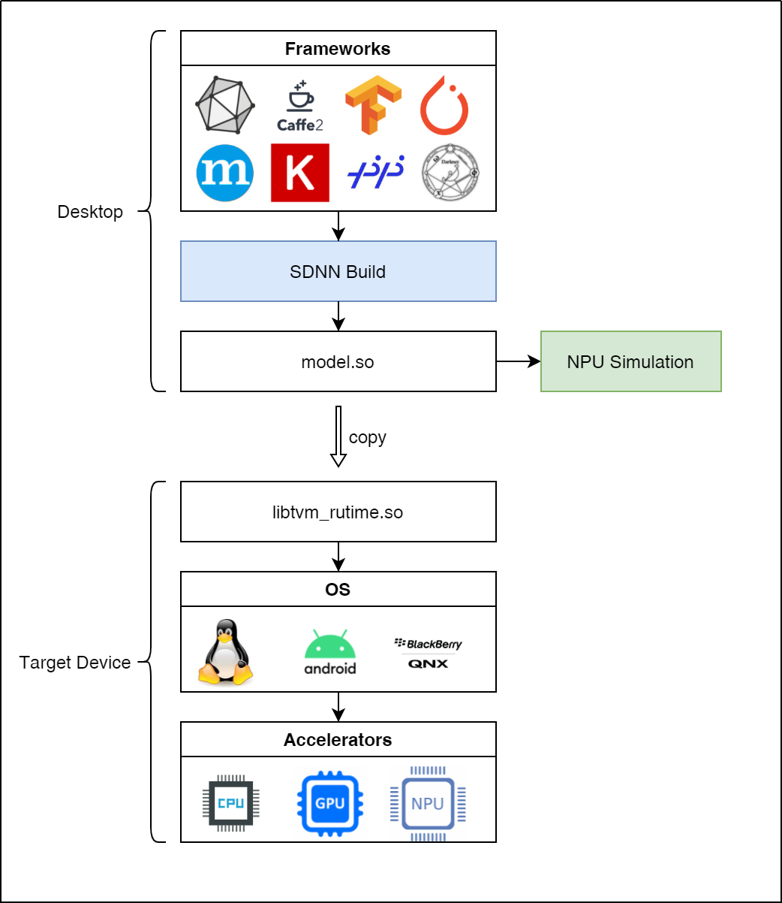
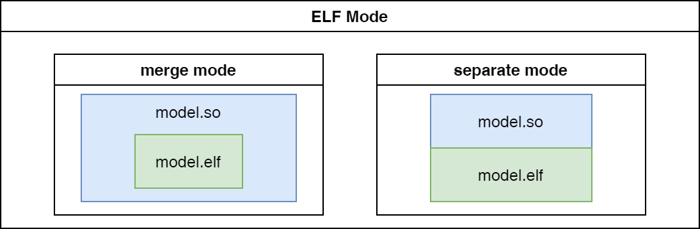

==========
SDNN Build
==========

Overview
========

The ``sdnn_build`` tool implements model compilation and converts the model files of different frameworks into the unified file format of SDNN framework. The model file can be sent to the NPU simulator for model performance and accuracy evaluation, or copied to the target device. By calling the corresponding runtime Libraries to implement deployment for different OS.

Use steps
=========

Get tool
--------

By `Customer Support System <https://www.semidrive.com/>`_ get the SDNN compilation toolkit, or click the version link below to get the tool：

+---------------+---------------------------------------------------+
| version       | describe                                          |
+===============+===================================================+
| `sdnn_build`_ | This version mainly optimizes the model file size |
+---------------+---------------------------------------------------+

.. _sdnn_build: https://gitee.com/zgh551/sdnn_doc/releases/download/2.2.3/sdnn_cl-2.2.3-cp36-cp36m-linux_x86_64.whl

Installation tool
-----------------

Then perform the following installation operations：

.. code-block:: shell
   :linenos:

   $ pip install sdnn_cl-2.2.3-cp36-cp36m-linux_x86_64.whl

.. note::

   #. The tool needs to be installed in the docker environment described in **Chapter 2**, other environments may not be available due to lack of compilation toolchain;
   #. If the sdnn-cl toolkit with the same version exists in the docker container, it needs to be uninstalled and then installed;

Model compilation
-----------------

Model compilation currently supports two modes, ``model file`` mode and ``json file`` mode.

**Model File Mode**

.. code-block:: shell
   :linenos:

   $ sdnn_build -f mobilenet_v2.onnx -a slimai

**Json File Mode**

.. code-block:: shell
   :linenos:

   $ sdnn_build -f mobilenet_v2.json -a slimai

Parameter Description
=====================

Overview
--------

The parameters used during compilation can be roughly divided into the following categories:

#. :ref:`base_params`：Contains the basic compilation options required to compile the model. Generally, model compilation only needs to pay attention to the parameters of this chapter;
#. :ref:`advanced_params`：Contains some parameter options that need to be used in special cases;
#. :ref:`quant_params`：Contains the parameters that need to be used for model quantization;
#. :ref:`debug_params`：Contains relevant parameters such as compilation and debugging and model simulation analysis;
#. :ref:`preprocess_params`：Contains parameters related to model preprocessing. If you use the sdnn_test program to evaluate the model, you need to pay attention to this parameter;
#. :ref:`postprocess_params`：Contains parameters related to model post-processing. If you use the sdnn_test program to evaluate the model, you need to pay attention to this parameter;

Basic parameters
----------------

.. table:: Basic parameters
   :name: base_params

   +---------------+-------------+---------+-----------------------------------------+-------------------------------------+
   | command       | abbreviated | default | range                                   | illustrate                          |
   +===============+=============+=========+=========================================+=====================================+
   | --help        | -h          |         |                                         | sdnn tool parameter description     |
   +---------------+-------------+---------+-----------------------------------------+-------------------------------------+
   | --version     | -v          |         |                                         | View SDNN version                   |
   +---------------+-------------+---------+-----------------------------------------+-------------------------------------+
   | --file        | -f          |         |                                         | model file or json file             |
   +---------------+-------------+---------+-----------------------------------------+-------------------------------------+
   | --cfg         | -c          |         |                                         | Specify the configuration file path |
   +---------------+-------------+---------+-----------------------------------------+-------------------------------------+
   | --host        |             | aarch64 | x86_64, aarch64                         | host platform                       |
   +---------------+-------------+---------+-----------------------------------------+-------------------------------------+
   | --os          |             | linux   | linux, android, qnx                     | operating system                    |
   +---------------+-------------+---------+-----------------------------------------+-------------------------------------+
   | --accelerator | -a          | cpu     | cpu, gpu, slimai                        | Inference accelerator               |
   +---------------+-------------+---------+-----------------------------------------+-------------------------------------+
   | --save        | -s          | models  |                                         | Model library save path             |
   +---------------+-------------+---------+-----------------------------------------+-------------------------------------+
   | --name        | -n          | default |                                         | model alias                         |
   +---------------+-------------+---------+-----------------------------------------+-------------------------------------+
   | --type        | -t          | onnx    | onnx, caffe, tf, tflite                 | Model file type                     |
   +---------------+-------------+---------+-----------------------------------------+-------------------------------------+
   | --domain      |             |         | Classification, Segmentation, Detection | model domain                        |
   +---------------+-------------+---------+-----------------------------------------+-------------------------------------+

file parameters
^^^^^^^^^^^^^^^

Model-related files are specified by ``-f`` 或 ``--file`` arguments,If the model contains multiple files(caffe) Or need to compile multiple models at the same time,This can be done by specifying multiple ``-f`` or ``--file`` arguments.

.. tabs::

   .. tab:: model file

      **single model compilation**

      1. *single file model*

      For example, the onnx model：

      .. code-block:: bash

         $ sdnn_build -f ./mobilenet_v2.onnx

      2. *multiple file model*

      For example, the caffe model, which contains two files:

      .. code-block:: bash

         $ sdnn_build -f ./mobilenet_v1.caffemodel -f ./mobilenet_v1.prototxt

      .. note::

         - Unlimited file order

      **multi-model compilation**

      Specify paths to multiple models via the ``--file`` or ``-f`` arguments.

      .. code-block:: bash

         $ sdnn_build -f ./mobilenet_v2.onnx -f ./mobilenet_v1.caffemodel -f ./mobilenet_v1.prototxt

      .. note::

         #. If you specify a model file, specify the relevant parameters of the model as needed, the json configuration file corresponding to the model will be automatically generated during compilation, and the parameters specified in the command line will be saved to the configuration file, which is convenient for subsequent compilation and use of the json configuration file;

   .. tab:: JSON file

      **single model compilation**

      .. code-block:: bash

         sdnn_build -f model1.json

      **multi-model compilation**

      .. code-block:: bash

         sdnn_build -f model1.json -f model2.json -f model3.json

      .. hint::

         The full format of the json configuration file is as follows：

         .. code-block:: json
            :linenos:

            {
             "model": {
                 "path": [
                     "xxx.caffemodel",
                     "xxx.prototxt"
                 ],
                 "name": "xxx",
                 "type": "xxx",
                 "channel_order": "RGB",
                 "domain": "Classification",
                 "output_layout": "NHWC",
                 "mean": [
                     0.485,
                     0.456,
                     0.406
                 ],
                 "std": [
                     0.229,
                     0.224,
                     0.225
                 ]
             },
             "dataset": {
                 "name": "ImageNet"
             },
             "metric": {
                 "method": "TopK",
                 "params": [
                     5
                 ]
             },
             "quant": {
                 "bit": "8bit"
             },
             "cfg": "./xxx.cfg"
            }

      .. note::

         #. If you specify a json configuration file, the configuration file contains model-related parameter information. If the model parameter information needs to be modified, you can open the file for modification, or add the parameters that need to be changed at compile time to correct the model parameters.

.. attention::

   #. After the model file is compiled for the first time, the **xxx.cfg.json** configuration file corresponding to the model will be automatically generated. Of course, it can also be created manually, and the necessary information is filled in according to the above complete format;
   #. If some parameters in the json configuration file are not specified at compile time, the default parameters will be filled. Before using the automatically generated **xxx.cfg.json** file, please confirm whether the content of the file matches the model;
   #. If the **cfg** field is specified in the json file, the parameters in the **quant** and **model** fields will be ignored, and the specified **cfg** field file will be used for NPU quantization;
   #. If ``no`` **cfg** field in the json file, the configuration file corresponding to the NPU will be automatically generated according to the parameters in the **quant** and **model** fields, with the file suffix **xxx.autogen.cfg** , the file path is the same directory as the model file.

cfg configuration file
^^^^^^^^^^^^^^^^^^^^^^

Specify the path of the NPU quantization configuration file through the parameter ``--cfg`` or ``-c``. Currently, the NPU device refers to SlimAI.

host platform
^^^^^^^^^^^^^

The target host platform for model compilation is configured with the parameter ``--host``, which defaults to **aarch64** .

.. note::

   #. **x86_64**：Refers to all devices that use x86_64 architecture CPU as the host, such as most PCs and servers, model files in this format can facilitate application debugging;
   #. **aarch64**：Refers to all CPUs of ARMV8 architecture, and 9 series chips belong to this framework;

operating system
^^^^^^^^^^^^^^^^

Configure the operating system corresponding to the deployed model file (.so) through the parameter ``--os``, and its default value is **linux** .

.. note::

   #. Currently 9 series chips support deployment systems including: linux, android and qnx;
   #. If the host selects x86_64, currently only linux systems are supported;

acceleration device
^^^^^^^^^^^^^^^^^^^

Configure the target inference device of model compilation via the parameter ``--accelerator`` or ``-a``, which defaults to **cpu** .

.. note::

   #. The acceleration devices currently supported by the 9 series chips include: **CPU**, **GPU** and **SlimAI**.
   #. If the host selects x86_64, currently only CPU devices are supported for model inference.

model save path
^^^^^^^^^^^^^^^

Configure the path to generate model files via the parameter ``--save`` or ``-s``, the default value is **models** . 
Under this path, a folder combined with the host platform and operating system will be generated, and the folder will contain a **xxx.so** library file and a **xxx.deploy.json** file.

model alias
^^^^^^^^^^^

Configured by the parameter ``--name`` or ``-n``, if not specified, the name of the model file will be used as the alias of the output model library.

.. note::

   #. Do not include characters such as ``-`` in aliases;
   #. If the model file name contains ``-`` characters, and no model alias is specified, the ``-`` characters in the model name will be automatically converted to ``_`` characters.

model file type
^^^^^^^^^^^^^^^

Configured by the parameter ``--type`` or ``-t``, if not specified, the model type will be identified by the suffix of the model file.

.. note::

   Currently supported models are: ``onnx`` , ``caffe`` , ``tf`` , ``tflite``

model domain
^^^^^^^^^^^^

Configured by the parameter ``--domain``, currently supports **classification** , **detection** and **segmentation** three domain models.

Advanced parameters
-------------------

.. table:: Advanced parameters
   :name: advanced_params

   +-----------------+--------------+----------+-----------------+---------------------------------------+
   | command         | abbreviation | default  | range           | illustrate                            |
   +=================+==============+==========+=================+=======================================+
   | --opt_level     | -l           | 3        | 1,2,3,4         | IR optimization level                 |
   +-----------------+--------------+----------+-----------------+---------------------------------------+
   | --elf_mode      | -m           | separate | merge, separate | Select model merge mode               |
   +-----------------+--------------+----------+-----------------+---------------------------------------+
   | --elf_build_off | -b           | False    |                 | Enable to close the compiled elf file |
   +-----------------+--------------+----------+-----------------+---------------------------------------+

ir optimization level
^^^^^^^^^^^^^^^^^^^^^

Configured via the parameter ``--opt_level`` or ``-l``, its default value is **3** .

.. note::

   If the optimized operator is not supported, it can be adjusted appropriately;

elf combination mode
^^^^^^^^^^^^^^^^^^^^

Configure the combination mode of **elf** file and **so** file through the parameter ``--elf_mode`` or ``-m``. This parameter is only valid for SlimAI device model compilation, and its default value is **separate** .

The difference between the two modes is shown in the following figure:

.. tabs::

   .. tab:: separate

      The **separate** mode is used by default when the model is compiled. In this mode, the **so** file and the **elf** file of the model are generated independently. Among them, the **elf** file contains the quantitative parameters of all models, and the **so** file only needs to contain the network structure of the corresponding model.

      .. note::

         If it is a multi-model compilation, the setting of this parameter is invalid, it is forced to **separate** mode, and **so** files of multiple models and a single **elf** file will be generated.

   .. tab:: merge

      Only single model compilation supports **merge** mode. In this mode, the **elf** file of the model is integrated into the **so** file of the model, and the final compilation only outputs a single **so** file.

      .. note::

         The existence of this mode is mainly to facilitate rapid testing and final product deployment. It is recommended to use the **separate** mode.

When deploying the model, you need to manually copy the **elf** file to the specified directory on the target board:

- **linux** ： ``/lib/firmware``
- **android** ： ``/vendor/firmware``
- **qnx** : ``/lib/firmware``

.. warning::

   **separate** mode is required for qnx system deployment, multi-process development and Android system APK code development;

elf file generation
^^^^^^^^^^^^^^^^^^^

Use the parameter ``--elf_build_off`` or ``-b`` to configure whether to turn off the **elf** file compilation process. This parameter is only valid for SlimAI device model compilation, and its default value is **False** .

.. note::

   #. This parameter is used to control whether the **elf** file is regenerated, that is, whether to quantize and optimize the floating-point model;
   #. If this parameter is not added, a new **elf** file will be generated based on the floating-point model requantization;
   #. Adding this parameter will invalidate the **elf** file generation. The general usage scenario is that after the **elf** file has been generated by the first compilation of the model, if you want to generate other ``OS`` deployment **so** files , you can turn off the generation of elf files, which can reduce compilation time.

Quantization parameters
-----------------------

.. table:: Quantization parameters
   :name: quant_params

   +-------------+-------------+---------+-------------------+---------------------------------------------------+
   | command     | abbreviated | default | range             | illustrate                                        |
   +=============+=============+=========+===================+===================================================+
   | --quant_bit | -qb         |         | 8bit, 16bit, auto | Configure the quantization bit width of the model |
   +-------------+-------------+---------+-------------------+---------------------------------------------------+

quantization bit width
^^^^^^^^^^^^^^^^^^^^^^

Configure the model quantization bit width through the parameter ``--quant_bit`` or ``-qb``, currently **8bit** and **16bit** are optional.

simulation debugging parameters
-------------------------------

.. table:: Simulation debugging parameters
   :name: debug_params

   +-------------------+--------------+---------+-------+--------------------------------------------+
   | command           | abbreviation | default | range | illustrate                                 |
   +===================+==============+=========+=======+============================================+
   | --debug           | -d           | False   |       | print compile debugging information        |
   +-------------------+--------------+---------+-------+--------------------------------------------+
   | --emu             | -e           | False   |       | Enable generation of simulation mode files |
   +-------------------+--------------+---------+-------+--------------------------------------------+
   | --dump_ir         | -ir          | False   |       | dump IR file                               |
   +-------------------+--------------+---------+-------+--------------------------------------------+
   | --dump_quant_err  | -qe          | False   |       | dump similarity at each level              |
   +-------------------+--------------+---------+-------+--------------------------------------------+
   | --dump_layer_prof | -lp          | False   |       | dump per-layer performance information     |
   +-------------------+--------------+---------+-------+--------------------------------------------+
   | --dump_path       | -p           | dump    |       | dump file directory                        |
   +-------------------+--------------+---------+-------+--------------------------------------------+

debug mode
^^^^^^^^^^

Configured by the parameter ``--debug`` or ``-d``, its default value is **False** .

.. note::

   When Debug mode is enabled for compilation, the intermediate information of the compilation phase will be output, and the relevant debugging information will be saved, which is convenient for the debugging of model compilation.

generate simulation model file
^^^^^^^^^^^^^^^^^^^^^^^^^^^^^^

Model file generation for simulation mode is configured via the parameter ``--emu`` or ``-e``, which defaults to **False** .

.. note::

   Simulation model file generation is currently only supported by slimai acceleration devices.

dump relay ir information
^^^^^^^^^^^^^^^^^^^^^^^^^

Configure the Relay IR information file of the generated model through the parameter ``--dump_ir`` or ``-ir``, the file will be saved in the path specified by the ``--dump_path`` parameter, and its default value is **False** .

dump quantization error information
^^^^^^^^^^^^^^^^^^^^^^^^^^^^^^^^^^^

Configure the quantization error analysis file for each layer of the generated model through the parameter ``--dump_quant_err`` or ``-qe``, the file will be saved in the path specified by the ``--dump_path`` parameter, and its default value is **False** .

similarity snalysis report
""""""""""""""""""""""""""

The similarity report similarity.txt finally outputs the following data, that is, the cosine similarity before and after quantization of the same node.

.. code-block:: bash
   :linenos:

   The similarity of nn_conv2d_760 between fixed and float model is: 0.996759
   The similarity of nn_bias_add_750 between fixed and float model is: 0.999363
   ...

The above cosine similarity value is the mean of this node over all validation images. There are many files in the same directory as the quantitative similarity analysis report.
The naming style is: netname_number, netname_ref, as follows:

.. code-block:: bash
   :linenos:

   ...
   mobilenet_v2_96
   mobilenet_v2_97
   mobilenet_v2_98
   mobilenet_v2_99
   ...
   mobilenet_v2_ref

The folder of network name **_number** such as mobilenet_v2_97,It stores the fixed-point output of this network when the range parameter is 97, and the folder with the network name **_ref** contains the floating-point output of this network. 

Each folder contains a large number of blob files, as follows:

.. code-block:: bash
   :linenos:

   cat_add_190.blob
   cat_add_200.blob
   cat_add_290.blob

In the above example, cat represents the name of the image, **add_xxx** represents the name of the node, and the whole represents the output of the add_190, add_200, and add_290 nodes when the input image is cat.png. In the blob, the first line records the scaling factor and dimension of the data and the data format. As follows in cat_add_190.blob.

.. code-block:: bash
   :linenos:

   63.499031 7 160 7 1 S8
   ...

#. ``64.499031`` : the scaling factor;
#. ``7 160 7 1`` : the output dimension of this node;
#. ``S8`` : the data type. The actual data starts from the second row.

dump performance information
^^^^^^^^^^^^^^^^^^^^^^^^^^^^

Configure the performance analysis file of the generated model through the parameter ``--dump_layer_prof`` or ``-lp``, the file will be saved in the path specified by the ``--dump_path`` parameter, and its default value is **False** .

Performance Analysis Report Format Description
""""""""""""""""""""""""""""""""""""""""""""""

The analysis report will eventually output the following data, which is the frame rate of the network:

.. code-block:: bash
   :linenos:

   PERFORMANCE 120.10 FPS @748.00MHz

According to the DSP clock frequency of 748MHZ, it can be calculated that one clock cycle is 1.3369ns, and the total network inference time is calculated as follows:

.. math::

   time_{Inference}= cycles_{total} * clock_{cycle}

In the same way, the time-consuming of each layer of network can be calculated according to the number of clock cycles of each layer of network, but it should be noted that the layer name of the simulation output may not match the layer name of the original model. The result of operator fusion and optimization.

   +----------------------+----------------------------------------------------------------------------------------------------+
   | parameter            | meaning                                                                                            |
   +======================+====================================================================================================+
   | Total Cycles         | The total clock cycle of this layer of network                                                     |
   +----------------------+----------------------------------------------------------------------------------------------------+
   | XI Kernel Cycles     | The number of computation cycles of the network kernel at this layer                               |
   +----------------------+----------------------------------------------------------------------------------------------------+
   | Edge Ext Cycles      | The number of network edge calculation cycles at this layer                                        |
   +----------------------+----------------------------------------------------------------------------------------------------+
   | DSP Idle WAIT Cycles | The number of idle waiting cycles of the network DSP of this layer                                 |
   +----------------------+----------------------------------------------------------------------------------------------------+
   | MACs per Cycles      | The number of MAC units used per clock cycle of the network at this layer                          |
   +----------------------+----------------------------------------------------------------------------------------------------+
   | MAC%                 | MAC unit utilization of this layer of network                                                      |
   +----------------------+----------------------------------------------------------------------------------------------------+
   | MACs                 | Calculate the total number of MAC units in this layer of network                                   |
   +----------------------+----------------------------------------------------------------------------------------------------+
   | DMA Queue Size       | The number of DMA queues used by the network at this layer                                         |
   +----------------------+----------------------------------------------------------------------------------------------------+
   | Layer Name           | The network name of this layer [Note: does not correspond to the layer name of the original model] |
   +----------------------+----------------------------------------------------------------------------------------------------+

dump path
^^^^^^^^^

Configure the save path of the dump file through the parameter ``--dump_path`` or ``-p``, the default value is **dump** .

Preprocessing parameters
------------------------

.. table:: Preprocessing parameters
   :name: preprocess_params

   +-----------------+--------------+---------+----------+---------------------+
   | command         | abbreviation | default | range    | illustrate          |
   +=================+==============+=========+==========+=====================+
   | --channel_order | -co          | RGB     | RGB, BGR | calor channel order |
   +-----------------+--------------+---------+----------+---------------------+
   | --mean          |              |         |          | the average value   |
   +-----------------+--------------+---------+----------+---------------------+
   | --std           |              |         |          | the variance        |
   +-----------------+--------------+---------+----------+---------------------+
   | --dataset       | -ds          |         | ImageNet | data set            |
   +-----------------+--------------+---------+----------+---------------------+

input channel order
^^^^^^^^^^^^^^^^^^^

Configure the model input channel format through the parameter ``--channel_order`` or ``-co``, currently the optional value is **RGB** or **BGR** .

input mean
^^^^^^^^^^

Configured by the parameter ``--mean``, the channel values are separated by ``,`` characters, and there can be no space symbols in between.

.. note::

   for example: --mean 1.23,45.67,8.0

input variance
^^^^^^^^^^^^^^

Configured by the parameter ``--std``, the channel values are separated by ``,`` characters, and there can be no space symbols in between.

.. note::

   for example: --std 1.2,32.34,34.34

data set
^^^^^^^^

Configure the dataset type of the model through the parameter ``--dataset`` or ``-ds``, currently supports **ImageNet** dataset processing.

Postprocessing parameters
-------------------------

.. table:: Postprocessing parameters
   :name: postprocess_params

   +-----------------+--------------+---------+---------------+----------------------------------+
   | command         | abbreviation | default | range         | illustrate                       |
   +=================+==============+=========+===============+==================================+
   | --output_layout | -ol          |         | NCHW, NHWC    | Set the model output node layout |
   +-----------------+--------------+---------+---------------+----------------------------------+
   | --metric        | -mt          | BinData | BinData, TopK | metric method                    |
   +-----------------+--------------+---------+---------------+----------------------------------+
   | --metric_params | -mp          |         |               | metric parameter                 |
   +-----------------+--------------+---------+---------------+----------------------------------+

output channel layout
^^^^^^^^^^^^^^^^^^^^^

Use the parameter ``--output_layout`` or ``-ol`` to configure whether to add a transpose operator to the model output node to perform channel transformation of the output node. The default value is **False** .

.. note::

   #. The model output node dimension must be 4 to enable this option;
   #. The parameter value represents the channel target layout, that is, if the output format of the original model is NCHW, and the parameter -ol NHWC is set, the tranpose operator will be added on the basis of the model output node to realize the transformation from NCHW to NHWC.

metric method
^^^^^^^^^^^^^

Configure the measurement method of the model through the parameter ``--metric`` or ``-mt``, which defaults to **BinData** .

metric parameter
^^^^^^^^^^^^^^^^

Configure the parameters of the model's measurement method via the parameter ``--metric_params`` or ``-mp``.

   +---------+-------------+------------------------------------------------+
   | method  | parameter   | illustrate                                     |
   +=========+=============+================================================+
   | BinData | None        | Save model output channel data                 |
   +---------+-------------+------------------------------------------------+
   | TopK    | k: k1,k2,k3 | Calculate the index of the top K weight values |
   +---------+-------------+------------------------------------------------+
